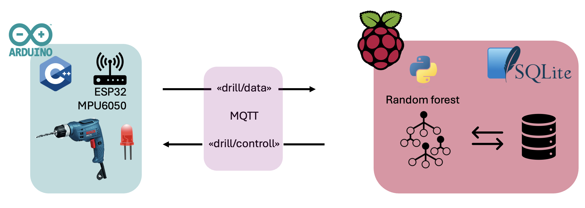
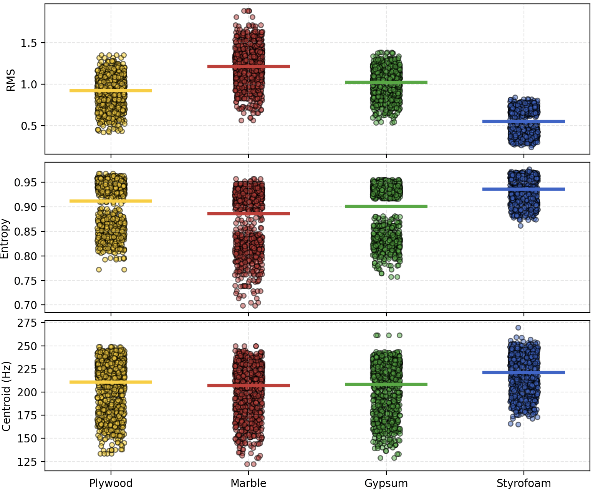
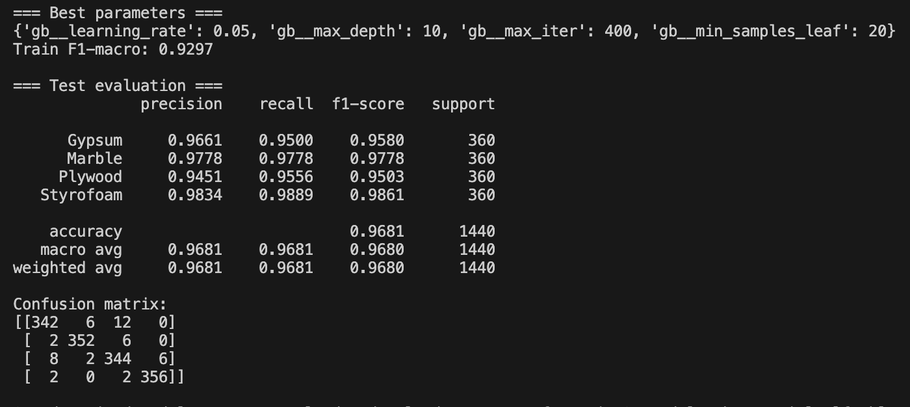
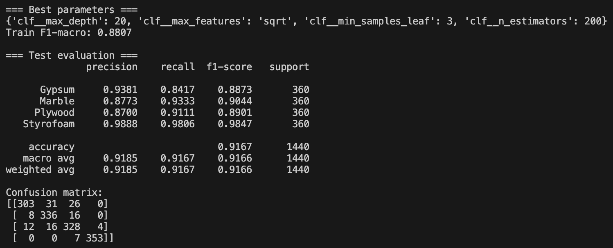
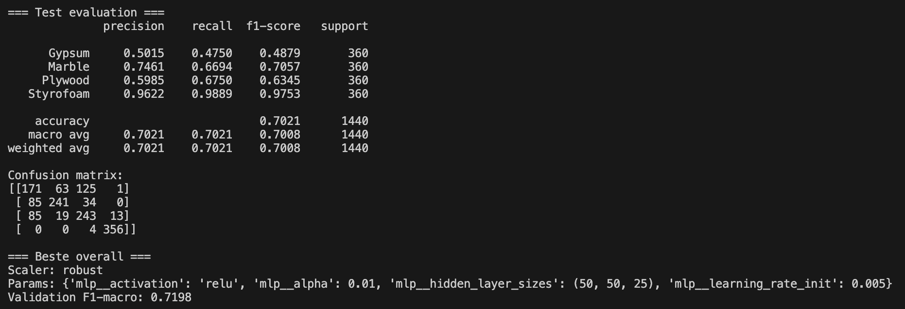

# Drill Material Detection

This project captures drilling vibration data with a Raspberry Pi + MPU-6050 accelerometer, extracts three signal features, and classifies the drilled material in real time using a pretrained Random Forest model.

---

## Features

1. **RMS Amplitude**  
   *Definition:* Root-mean-square of the vibration signal in each analysis window.  
   *Captures:* Overall vibration energy—denser or harder materials yield higher RMS.

2. **Spectral Entropy**  
   *Definition:* Shannon entropy of the normalized power spectral density.  
   *Captures:* Signal complexity—more heterogeneous materials produce broader spectra.

3. **Spectral Centroid**  
   *Definition:* “Center of mass” of the power spectrum (Hz).  
   *Captures:* Dominant vibration frequency—harder materials shift energy upward.

---

## Material Classification

Classification thresholds are calibrated per material:

| Material  | RMS Threshold   | Entropy Threshold | Centroid Threshold (Hz) |
| --------- | --------------- | ----------------- | ----------------------- |
| Styrofoam | < 0.500         | > 0.920           | < 50                    |
| Plywood   | < 0.9564        | > 0.8995          | > 206.0871              |
| Gypsum    | 0.9564 – 1.1044 | 0.8856 – 0.8995   | 204.3948 – 206.0871     |
| Marble    | > 1.1044        | < 0.8856          | < 204.3948              |

1. Compute the three features for each window of sensor data (RMS, Spectral Entropy, Spectral Centroid).
2. Compare to thresholds in order: Plywood → Gypsum → Marble.
3. Assign the first material whose three threshold‐conditions are all true:
   - **Plywood** if  
     • rms < 0.9564  
     • entropy > 0.8995  
     • centroid > 206.0871  
   - **Gypsum** if (not Plywood) and  
     • rms < 1.1044  
     • entropy > 0.8856  
     • centroid > 204.3948  
   - **Marble** otherwise.

---
## Performance

---
*Erlend Dragland, 2025*
